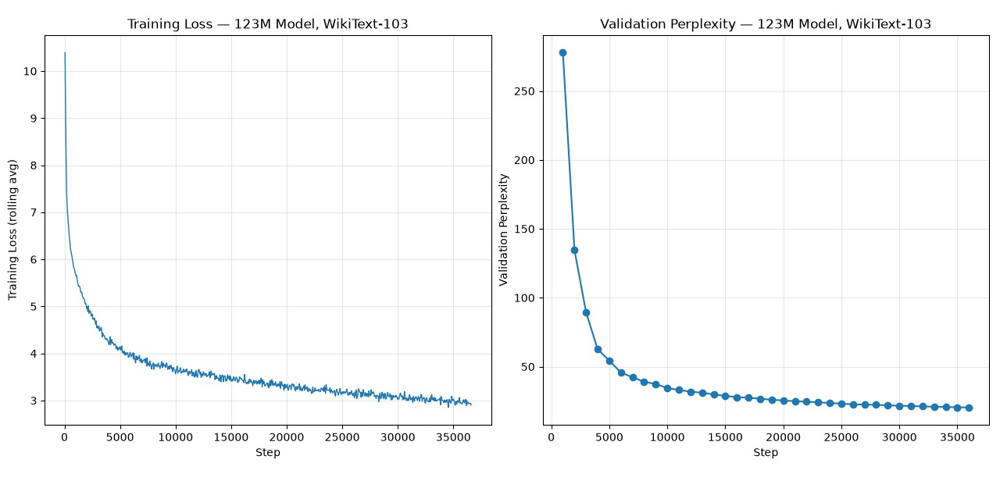

# Transformer From Scratch — 123M Parameter Decoder-Only LLM with Custom CUDA Attention Kernel

A decoder-only transformer built entirely from first principles in PyTorch — every component (embeddings, RoPE, multi-head attention, RMSNorm, SwiGLU, output projection) implemented and numerically verified against reference math, trained to convergence on real data, and accelerated with a hand-written, hand-derived CUDA attention kernel.

**[Try the live demo →](#)** *(Hugging Face Space link)*
**[Model card →](#)** *(Hugging Face model repo link)*

---

## Overview

This project builds a GPT-2-scale (123.6M parameter) language model without relying on any high-level transformer abstractions (`nn.Transformer`, `nn.MultiheadAttention`, HuggingFace model classes). Every mathematical component is implemented from raw tensor operations, verified against independently-derived reference implementations, and composed into a model that trains, converges, and generates coherent text — with a custom CUDA kernel replacing the attention hot path, verified correct to float32 precision.

The project is organized into five phases, each with an explicit, numerically-checked "done" criterion — not just "it runs," but "it's provably correct."

---

## Results Summary

| Metric | Value |
|---|---|
| Parameters | 123,551,232 (123.6M) |
| Architecture | dim=768, heads=12, layers=12, tied embeddings |
| Training data | WikiText-103 |
| Training steps | 36,621 (~3 epochs) |
| Final validation perplexity | 19.24 |
| Next-token accuracy (top-1) | 44.61% |
| Next-token accuracy (top-5) | 66.07% |
| Train/val perplexity gap | +0.30 (minimal overfitting) |
| Hardware | NVIDIA A40, ~9 hours |

**CUDA Kernel (Phase 4):**

| | PyTorch (reference) | Custom CUDA kernel |
|---|---|---|
| Forward pass correctness | — | max error 1.49e-07 |
| Backward pass correctness | — | max error < 8e-06 (all params) |
| Forward+backward speed | 21.94ms | 160.69ms (13.7% of PyTorch throughput) |

The kernel is a **correctness-first**, unoptimized implementation (single-thread reductions, atomic accumulation, no shared-memory tiling) — it is slower than PyTorch's cuBLAS/cuDNN-backed attention by design, not by accident. See [Phase 4](#phase-4--custom-cuda-attention-kernel) for the honest performance breakdown and what a faster version would require.

---

## Training Curve



Validation perplexity drops from 277.78 (step 1000) to 19.24 (step 36000), with a clear, smooth plateau in the final third of training — evidence of genuine convergence, not premature stopping.

---

## Architecture

tokens → embedding (tied w/ output projection)
→ [TransformerBlock × 12]
├─ RMSNorm → Multi-Head Attention (RoPE, causal) → residual
└─ RMSNorm → SwiGLU MLP → residual
→ final RMSNorm
→ output projection → logits

- **RoPE** (Rotary Position Embeddings) — applied to Q, K inside every attention layer, shared module instance across all blocks
- **Pre-norm residual connections** — normalization on the branch, not the residual stream (Llama/Mistral-style, better gradient flow than post-norm)
- **SwiGLU** feed-forward, hidden_dim = 8/3 × dim (FLOP-matched to a standard 4× non-gated MLP)
- **Tied embeddings** — input embedding and output projection share one weight matrix (~38.6M parameters saved)

---

## Phase-by-Phase Breakdown

### Phase 1 — Components From Scratch
Six components (embedding, RoPE, multi-head attention, RMSNorm, SwiGLU, output projection), each implemented in pure PyTorch tensor ops and verified against a hand-written, mathematically transparent reference implementation.

**Result:** All 6 gates passed, max error < 1e-4 (typically 1e-6 to 1e-8) against reference.

### Phase 2 — Backward Pass & Training Loop
Composed components into `TransformerBlock`/`TransformerModel` with pre-norm residuals. Verified gradients via finite-difference checks against representative parameters, confirmed the model can overfit a tiny batch to near-zero loss, and built the full training loop (AdamW, linear warmup+decay, gradient clipping, checkpointing with resume support).

**Notable bug caught here:** RoPE was initially wired to only the first transformer block instead of every block — a composition bug invisible to Phase 1's isolated component tests, caught by reviewing the full model's behavior.

**Result:** Gradient checks passed (<1e-4 relative error), overfit test reduced loss 24.48→0.000118.

### Phase 3 — Train to Convergence
Trained the 123.6M model on real WikiText-103 data for 36,621 steps (~9 hours, NVIDIA A40).

**Notable bug caught here:** embedding initialization used `std=1.0` rather than the standard `std=0.02`. Combined with weight tying, this created a self-similarity artifact where the model's own embedding vectors dotted with themselves produced artificially large logits for the "correct" token — yielding a deceptively near-zero loss (0.0) on a completely *untrained* model. Caught via a targeted diagnostic before the long training run, fixed by scaling down initialization.

**Result:** Validation perplexity plateaued at 19.24, 44.61% next-token accuracy, coherent multi-sentence sample generations.

### Phase 4 — Custom CUDA Attention Kernel
Hand-derived and implemented the full attention forward pass (scores → causal mask → softmax → weighted sum) and backward pass (full softmax-Jacobian gradient derivation for dQ, dK, dV) as raw CUDA kernels, bridged into PyTorch via `torch.autograd.Function` and a C++/pybind11 extension.

**Verified:**
- Forward/backward numerically match PyTorch's reference attention (Gate 4A) — at both small (dim=64) and target (dim=768) scale, on two different GPU architectures (Tesla T4, NVIDIA A40)
- The model trains correctly end-to-end with the CUDA kernel swapped in for every attention layer (Gate 4B) — overfit test reduced loss 61.08→0.000116

**Honestly reported:** the kernel is 7.3x slower than PyTorch's native attention. This is an explainable, expected result of a correctness-first design (no parallel reductions, no shared-memory tiling, atomic-based accumulation) rather than a flaw — optimizing this further is legitimate follow-up work, not required for the kernel's correctness claim.

### Phase 5 — Documentation & Reproducibility
This repository, its structure, and this README.

---

## Repository Structure

transformer_scratch/
├── modules/                    # Phase 1 components + Phase 2 composition
│   ├── embedding.py
│   ├── positional.py           # RoPE
│   ├── attention.py            # PyTorch reference attention
│   ├── attention_cuda.py       # CUDA kernel wrapper (Phase 4)
│   ├── rmsnorm.py
│   ├── swiglu.py
│   ├── output_projection.py
│   ├── transformer_block.py
│   └── transformer_model.py
├── kernels/
│   └── attention_cuda.cu       # Hand-derived forward + backward CUDA kernels
├── tests/                      # Phase 1-4 verification gates
├── data/
│   └── data_loader.py          # WikiText-103 streaming + tokenization
├── run_phase1_gates.py
├── run_phase2_gates.py
├── run_phase3_gates.py
├── train.py                    # Step-bounded training loop w/ resume support
├── evaluate_final_model.py     # Final accuracy/perplexity/repetition evaluation
├── benchmark_attention.py      # PyTorch vs. CUDA kernel speed comparison
├── diagnose_bottleneck.py      # CPU vs GPU throughput diagnostic
├── plot_training_curve.py      # Reconstructs training curve from logs
├── training_log.txt            # Full training run log (123M model)
├── training_curve_123M_wikitext.png
└── requirements.txt

---

## Reproducing This Project

```bash
git clone https://github.com/krishang-1/Transformer_Scratch.git
cd Transformer_Scratch
pip install -r requirements.txt
```

**Run Phase 1-3 verification gates:**
```bash
python run_phase1_gates.py
python run_phase2_gates.py
python run_phase3_gates.py
```

**Verify the CUDA kernel** (requires a CUDA-capable GPU):
```bash
python -m tests.test_cuda_attention
```

**Train from scratch:**
```bash
python train.py --total-steps 36621 --batch-size 8 --seq-len 1024 --device cuda
```

**Evaluate a trained checkpoint:**
```bash
python evaluate_final_model.py
```

Trained weights are hosted separately on [Hugging Face](#) (not included in this repository — see model card for download).

---

## Known Limitations

- **CUDA kernel is unoptimized.** Single-thread max/sum reductions and atomic-based accumulation are real bottlenecks; a tiled, warp-parallel implementation would close most of the 7.3x gap.
- **Gradient checks are sampled, not exhaustive.** Phase 2's finite-difference verification checks representative parameters (embedding, one attention weight, one SwiGLU weight, output projection), not every individual weight tensor.
- **Evaluation is a substantial sample, not the full validation set.** Final metrics computed over ~123K tokens (30 batches) of WikiText-103's validation split.
- **No fp16/bf16 support.** The kernel currently supports float32 only.

---

## Hardware Used

- Training: NVIDIA A40 (RunPod), ~9 hours
- CUDA kernel verification: Tesla T4 (Google Colab) and NVIDIA A40
